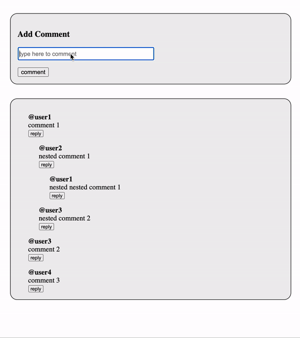

# Comments Widget

Comments widget with support for nested comments made with vanilla JS.



## How It Works

This project uses a tree data structure to store comments, the replies to comments are stored as children to the comment.

```
const comments = [
    {
        username : '@user1',
        commentId : '1',
        text : 'comment 1',
        time : '',
        comments : [
            {
                username : '@user2',
                commentId : '4',
                text : 'nested comment 1',
                time : '',
                comments: [
                    {
                        username: '@user1',
                        commentId: '6',
                        text: 'nested nested comment 1',
                        time : '',
                        comments: []
                    }
                ]
            },
            {
                username : '@user3',
                commentId : '5',
                text : 'nested comment 2',
                time : '',
                comments: []
            }
        ]
    },
    {
        username : '@user3',
        commentId : '2',
        text : 'comment 2',
        time : '',
        comments : []
    },
    {
];
```

For painting the comments to the DOM, the tree structured is traversed and the required html is generated recursively.

```
function makeComment(comment, child){
    const res = `
    <div class="comment">
    <p class="comment-username">${comment.username}</p>
    <p class="comment-text">${comment.text}</p>
    <button class="reply-btn" id=${comment.commentId}>reply</button>
    ${child}
    </div>
    `;

    return res;
}

function createComment(comment){
    // base case
    if(comment.comments.length === 0){
        return makeComment(comment, '')
    } else{
        let child = ``;
        for(let i=0; i<comment.comments.length; i++){
            child = child + createComment(comment.comments[i]);
        }
        return makeComment(comment, child);
    }
}

function createComments(comments) {
    let ans = ``;

    for(let i=0; i<comments.length; i++){
        ans = ans + createComment(comments[i]);
    }

    return ans;
}
```

## How To Run

```
$ git clone https://github.com/achalsaharan/comments-widget
$ cd comments-widget
$ open index.html
```
